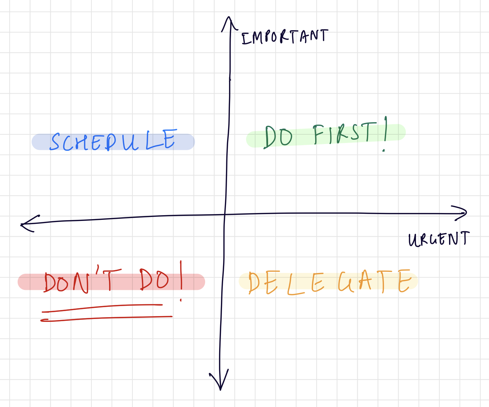

Ah, it has been quite a while since I have posted anything! I have been occupied with a few things, and now that I realize, it was a bad thing to have stopped posting at all. I will try my best to get my head up in the game from today. 

So, what do we have here? The Eisenhower Matrix. Okay, let’s admit it, we have heard of this productivity tool in one form or the other. 

“Don’t sacrifice the important for the urgent!” is a phrase that gets thrown around a lot that when talking about time management and general productivity mantras. Now this is the version of Eisenhower that is the most familiar among the masses. 

Academically speaking, or rather generally, Eisenhower Matrix is a productivity framework which helps you prioritize your tasks to understand what needs the most attention. The way you do the classification is by questioning the importance and urgency of tasks. 

Let me give you a simple example. As you may witness in the picture, the axes split the space into 4 quadrants with each suggesting different combinations of whether the task is urgent or not, and important or not. 

What is also shown in the picture is how you deal with each of the groups of tasks, like you delegate the tasks which are not important but urgent. 

Okay, so I believe you got the premise, but it is time for the actual burning question. Why isn’t a completely interactive Eisenhower web app present on the internet? 

The closest example I found was [https://app.eisenhower.me](https://app.eisenhower.me/), which is nothing but 4 to-do lists put together. And it requires you to sign up! Why? And who’s to guarantee that the data is secure. 

The other options, may sound medieval, include Miro and download-and-use PDF templates. Too boring. I need something on the go. Something that makes me use this more and more. Okay maybe it’s a bit too much; the only reason why you would use a Eisenhower Matrix is because of how good it is. 

Let me explain. These days, unless you are living under a rock, one is constantly thrown with multiple things at once to keep track of, a nice consequence of work moving online. Partly because we are moving towards an era where we won’t be able to compartmentalize work and life and partly because we are generally becoming more productive as a species. So, now this means that we need to come up with ways to organize our lives to suit to the pace. 

Personally, this issue is a real one. I have had a lot of situations where *I compromised the important for the urgent*, just because there was no system in place where I could classify them. But now, I use this matrix on a day to day basis. But, on a paper which can get messy sometimes. 

So, I think this calls for a new project for the productivity junkies community that includes caffeine-driven individuals like me. A cleaner, secure, better Eisenhower Matrix.
